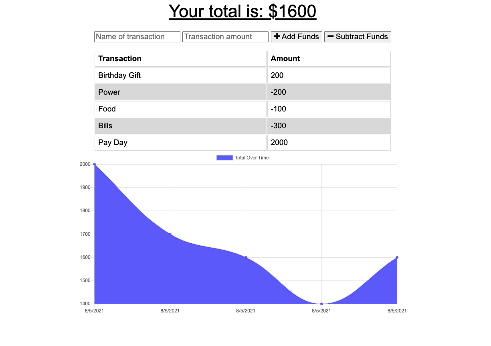

# Progressive Budget Tracker

 

## Description

This project is a progressive web application that allows users to track their budget both online and offline. When offline, items can be added to the application and will be updated automatically once the user is back online. This project utilizes [MongoDB](https://www.mongodb.com/) when online, and [DBIndexed](https://developer.mozilla.org/en-US/docs/Web/API/IndexedDB_API) when offline (once online, these items will push to the [MongoDB](https://www.mongodb.com/) database). Regardless of the user's access to the internet, this [PWA](https://developer.mozilla.org/en-US/docs/Web/Progressive_web_apps) website will allow the user to view their budget entries as well as all previous entries. New entries are stored in the [DBIndexed Database](https://developer.mozilla.org/en-US/docs/Web/API/IndexedDB_API) and are pushed to the [MongoDB Database](https://www.mongodb.com/) once back online.

## Table of Contents

- [About the Project](#about-the-project)
- [Installation](#installation)
- [Usage](#usage)
- [Contributing](#contributing)
- [Tests](#tests)
- [License](#license)
- [Questions](#questions)

## About the Project

- This [PWA](https://developer.mozilla.org/en-US/docs/Web/Progressive_web_apps) website will allow the user to view their budget entries as well as all previous entries.
- New entries are stored in the [DBIndexed Database](https://developer.mozilla.org/en-US/docs/Web/API/IndexedDB_API) and are pushed to the [MongoDB Database](https://www.mongodb.com/) once back online.
- Both static files and the current data are captured in the **Cache Storage** for when the user goes offline (allowing the user to access the application regardless of their internet access).
- Built with the following technologies:
  - [express](https://www.npmjs.com/package/express)
  - [compression](https://www.npmjs.com/package/compression)
  - [lite-server](https://www.npmjs.com/package/lite-server)
  - [mongoose](https://www.npmjs.com/package/mongoose)
  - [morgan](https://www.npmjs.com/package/morgan)
  - [HTML](https://www.w3schools.com/html/), [CSS](https://www.w3.org/Style/CSS/Overview.en.html), and [Javascript](https://www.javascript.com/)
  - [nodemon](https://www.npmjs.com/package/nodemon)
  - [Bootstrap](https://getbootstrap.com/)
  - [Chart.js](https://www.npmjs.com/package/chart.js)

## Installation

- Open [Progressive Budget Tracker](https://github.com/twashke/Progressive-Budget-Tracker).
- Use the command line to **git clone**
- **npm install**
- Must have [MongoDB](https://www.mongodb.com/) installed locally to save data.
- **npm start** from command line to connect server.
- Go to [localhost:3001](http://localhost:3001/) in Web Browser to view.
- Left click and choose **Inspect** to see Chrome Dev Tools.
- Go to the **Application** section and under **service-workers** click **Offline**.
- Enter a new item into the [Progressive Budget Tracker](https://progressivebudgettracker082021.herokuapp.com/).
- Go back and unclick the **Offline** option and enter another item.
- The items offline and the recent online entry should be displayed in the history.

## Usage

- Go to [Deployed Progressive Budget Tracker Website](https://progressivebudgettracker082021.herokuapp.com/)
- Left click and choose **Inspect** to see Chrome Dev Tools.
- Go to the **Application** section and under **service-workers** click **Offline**.
- Enter a new item into the [Progressive Budget Tracker](https://progressivebudgettracker082021.herokuapp.com/).
- Go back and unclick the **Offline** option and enter another item.
- The items offline and the recent online entry should be displayed in the history.

 \
\

## Contributing

- Code provided for a portion of project.

## Tests

- Testing throughout project developement to ensure everything works as intended.

## License

This application is covered by the [MIT License](https://opensource.org/licenses/MIT).

      Copyright 2021 Tiffany Washke

      Permission is hereby granted, free of charge, to any person obtaining a copy of this software and associated documentation files (the "Software"), to deal in the Software without restriction, including without limitation the rights to use, copy, modify, merge, publish, distribute, sublicense, and/or sell copies of the Software, and to permit persons to whom the Software is furnished to do so, subject to the following conditions:

      The above copyright notice and this permission notice shall be included in all copies or substantial portions of the Software.

      THE SOFTWARE IS PROVIDED "AS IS", WITHOUT WARRANTY OF ANY KIND, EXPRESS OR IMPLIED, INCLUDING BUT NOT LIMITED TO THE WARRANTIES OF MERCHANTABILITY, FITNESS FOR A PARTICULAR PURPOSE AND NONINFRINGEMENT. IN NO EVENT SHALL THE AUTHORS OR COPYRIGHT HOLDERS BE LIABLE FOR ANY CLAIM, DAMAGES OR OTHER LIABILITY, WHETHER IN AN ACTION OF CONTRACT, TORT OR OTHERWISE, ARISING FROM, OUT OF OR IN CONNECTION WITH THE SOFTWARE OR THE USE OR OTHER DEALINGS IN THE SOFTWARE.

## Questions

**Contact Tiffany Washke**

- **Email directly at** twashke@gmail.com
- **GitHub User Name:** [twashke](https://github.com/twashke)

